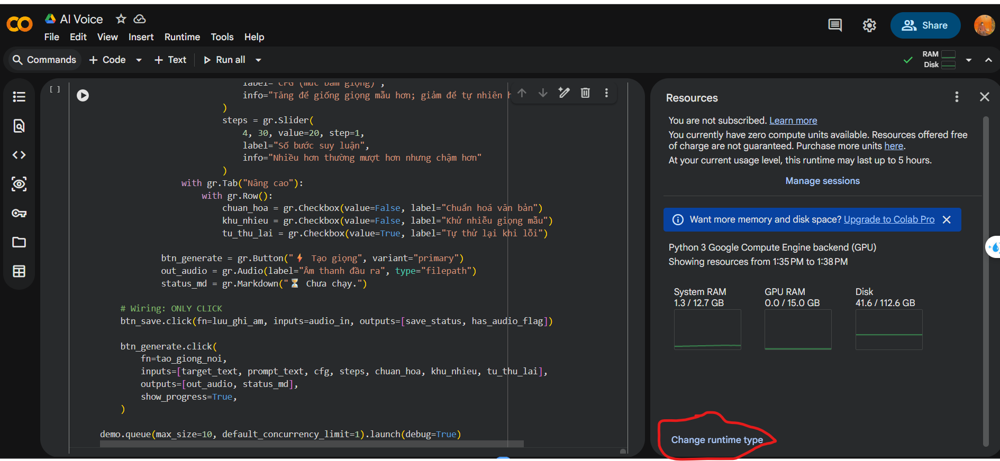
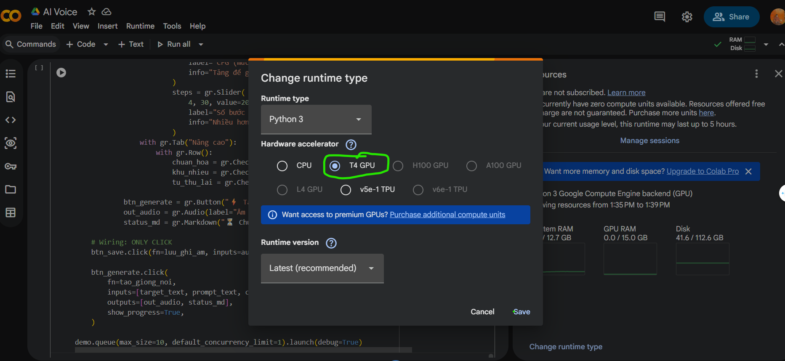
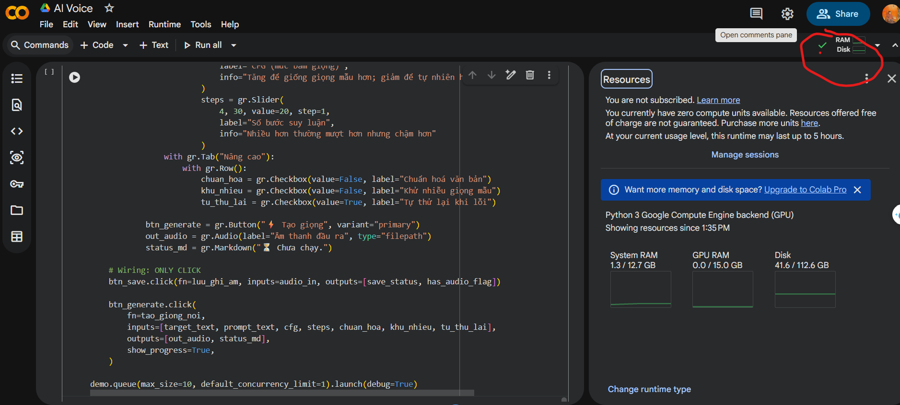

# AI Voice — Hướng dẫn chạy trên Google Colab (GPU)

Hướng dẫn ngắn để chạy project AI Voice trên Google Colab và bật GPU. Kèm 3 ảnh minh họa cách vào `Runtime -> Change runtime type` và chọn GPU (ví dụ T4).

**Lưu ý trước khi bắt đầu**
- Cần tài khoản Google và truy cập Colab: https://colab.research.google.com
- Nếu bạn muốn sử dụng GPU cao cấp (H100/A100) có thể cần Colab Pro/Pro+ hoặc compute units trả phí.

**Chuẩn bị ảnh**
- Đặt 3 ảnh vào thư mục `assets/` trong repo với tên sau:
  - `assets/colab_gpu_1.png`
  - `assets/colab_gpu_2.png`
  - `assets/colab_gpu_3.png`

Bạn có thể tải 3 ảnh (được cung cấp kèm theo) vào các đường dẫn trên để README hiển thị trực quan.

**Hướng dẫn từng bước (Colab)**

1) Mở Google Colab và tạo notebook mới hoặc mở từ repo.

2) Thay đổi loại runtime để bật GPU:
- Chọn menu `Runtime` → `Change runtime type`.
- Trong `Hardware accelerator` chọn `GPU` (ví dụ: `T4`).
- Nhấn `Save`.

Hình minh họa:







3) (Tùy chọn) Mount Google Drive nếu bạn cần truy xuất dữ liệu hoặc lưu file:

```python
from google.colab import drive
drive.mount('/content/drive')
```

4) Cài đặt phụ thuộc và chạy project (ví dụ):

```bash
# Cài đặt requirements (nếu có file requirements.txt)
!pip install -r requirements.txt

# Hoặc cài các package cần thiết ví dụ
!pip install torch torchvision
```

5) Kiểm tra GPU đã hoạt động hay chưa:

```bash
# Kiểm tra thông tin GPU
!nvidia-smi

# Kiểm tra PyTorch có thấy GPU không
import torch
print('CUDA available:', torch.cuda.is_available())
print('Device count:', torch.cuda.device_count())
if torch.cuda.is_available():
    print('Current device:', torch.cuda.get_device_name(0))
```

**Lưu ý & mẹo**
- Nếu Colab báo không có GPU: kiểm tra lại `Runtime -> Change runtime type` và chắc chắn đã `Save`.
- Một số tài khoản miễn phí có giới hạn tài nguyên; nếu cần GPU ổn định hơn, cân nhắc nâng cấp Colab Pro.
- Nếu bạn muốn mình chèn trực tiếp 3 file ảnh vào repo, hãy upload các ảnh đã đính kèm vào thư mục `assets/` (đặt tên như trên) và mình sẽ cập nhật README để nhúng ảnh thực tế.

---

File README đã tạo: [README.md](README.md)
Ảnh tham chiếu (tạo thư mục `assets/` và upload 3 ảnh): [assets/colab_gpu_1.png](assets/colab_gpu_1.png), [assets/colab_gpu_2.png](assets/colab_gpu_2.png), [assets/colab_gpu_3.png](assets/colab_gpu_3.png)
